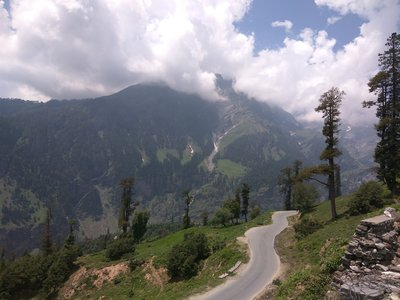

# neural style
This is a tensorflow implementation of  [A Neural Algorithm of Artistic Style](http://arxiv.org/abs/1508.06576).
Neual style transfer makes use of convolutional neural networks to combine the features of two images.

Here's an example that combines the features of image of hill station captured by me and [Starry night](https://en.wikipedia.org/wiki/The_Starry_Night)

<<<<<<< HEAD
     
 
=======
 
    
 
>>>>>>> 06c0b616335d885a23f7cc9ca8382924ea2073a3


# Usage
### Basic usage
Place the images in images directory, and run the nn module.


## Setup
##### Dependencies:
- tensorflow
- numpy
##### Model
```
sh download_model.sh
```
This will download the model in /model directory.
- [VGG -19 model](http://www.vlfeat.org/matconvnet/pretrained/).

It takes around 3 mins for 20 epochs on CPU.  
#### -options
- Layer options : You can make use of other features lke style interpolation, content/style tradeoff, style scale by changing style_layers module.
  - style_layers: Comma-separated list of layer names to use for style reconstruction. Default is conv1_1, conv2_1, conv3_1, conv4_1, and conv5_1
- Output options: Generated images are placed in output by default.
You can change the address in nn module.

### Optimization options:

- num_iterations: 200.
- optimizer: Adam, lbfgs may be used and may give better results but will consume more memory.
- learning_rate: Learning rate to use with the ADAM optimizer. Default is 2.0

### Implementation details

Images are initialized with white noise.
Adam Optimizer has been used

We perform style reconstructions using the conv1_1, conv2_1, conv3_1, conv4_1, and conv5_1 layers . As in the paper, the five style reconstruction losses have equal weights.
